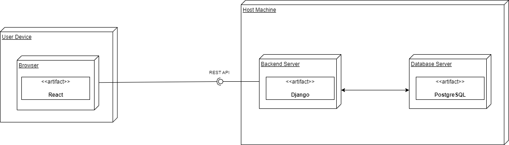
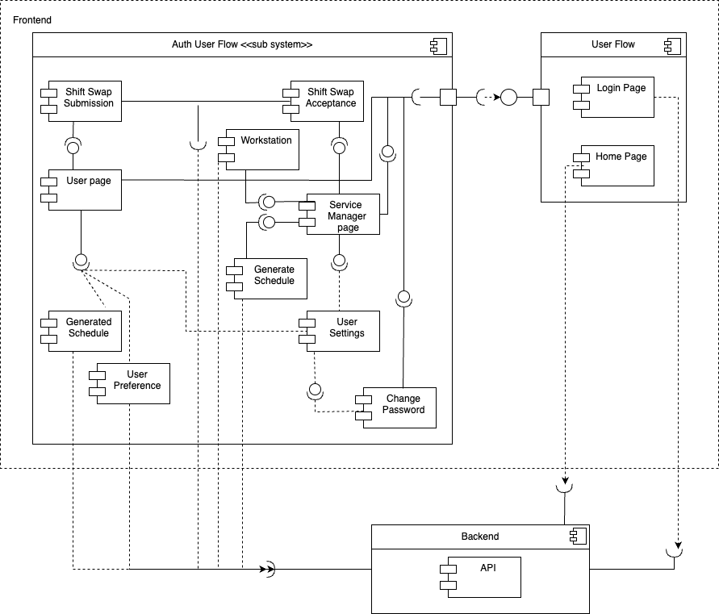
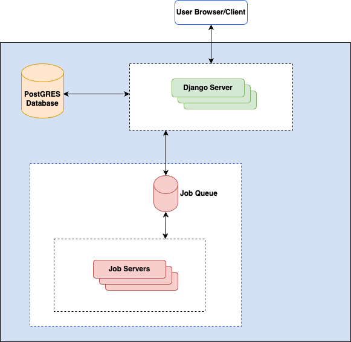
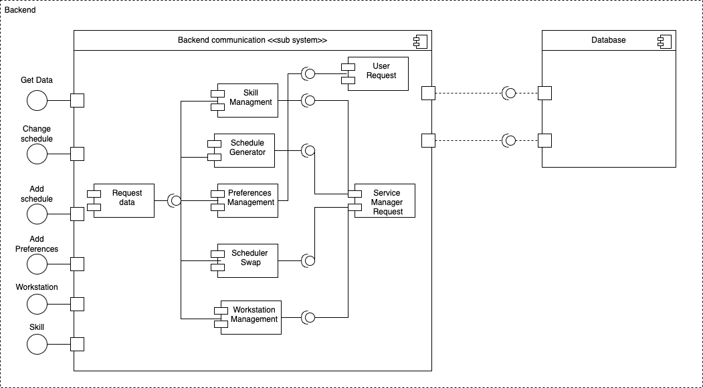
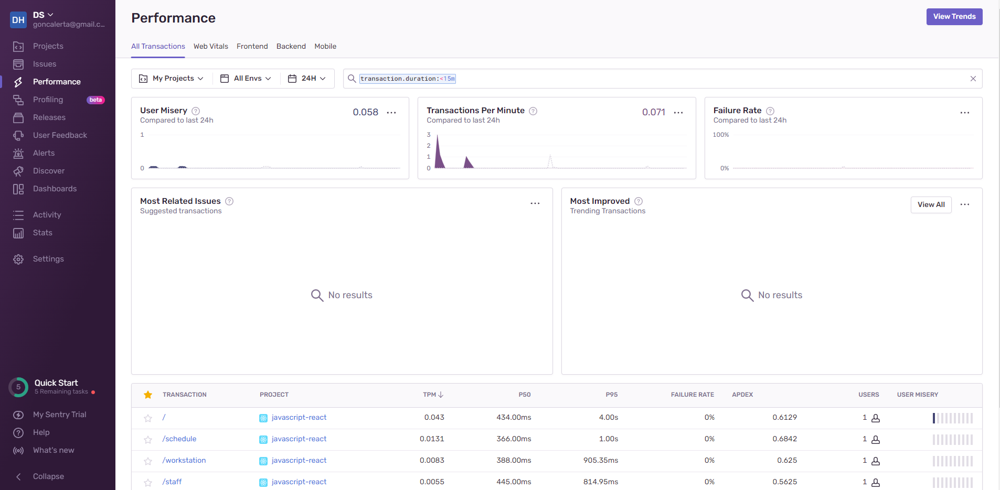

# Development

## Architecture and design

Our system's architecture follows the steps of most traditional web applications. For starters, the client-server architecture was adopted, as it is the most common and accepted way of developing this type of applications. The following diagram details how this is supposed to work:



### Client-Side Architecture

On the user side, we can see that only [React](https://reactjs.org/) is being used as a client-side library, and it will make all the requests for the user's machine. This makes the client side lighter and most of the work is made server-side, so that the page runs smoothly on slower machines. The only real downside is all the requests that have to be made to fetch the appropriate data, which can cause some overhead in the load times. However, on most machines and for most use cases this overhead is negligible.

Looking deeper into the client-side architecture, we can see the following:



There are several different components inside the frontend architecture, very connected with each other. The different services handle different responsibilities, but they communicate with each other to make sure the application runs as it should. Most of them also communicate with our backend API using the REST endpoints exposed by it, retrieving the necessary data to show to the user or submitting data for processing.

### Communication

We decided to use a REST API, since it is the _de facto_ standard of the web and it is the method that we have the most experience dealing with. A REST API like this allows for a clean separation between frontend and backend, making it much easier for us to split the workload between the different teams.

The only feasible alternative would be something like [GraphQL](https://graphql.org/), but since it is a recent technology not well understood by most members of the team, it was scrapped in favor of the more well defined REST.

### Server-Side Architecture

An overall view of the backend architecture is the following:



This follows the traditional backend architecture, with the addition of a Job Queue. Since some of the work done by the server can be very intensive, like generating a schedule from all the possible restrictions, a Job Queue will allow the system to submit different tasks and generate a job pool, which the server can then use for batch processing.

The main goal of this queue is to increase the efficiency of use of the server's resources, whilst minimizing idle time and allowing for almost constant utilization of the different resources.

To see how the server works in more detail, the image below gives a good description



It is possible to see that there will be several endpoints available, each to handle a specific task. This goes in line with REST conventions, and allows us to develop a more modular architecture. Also, inside the server there are different components handling different jobs, making the server itself more interchangeable and making it easier to split the tasks into different services, if needed in the future.

## Technology

The backend of the application should be implemented in [django](https://www.djangoproject.com/), as per the technology requirements imposed by the client, in order to enable a faster development. The teams have decided to implement a REST API with [Django REST framework](https://www.django-rest-framework.org/) in order to have the backend decoupled from the frontend and to relieve the backend from the generation and serving of HTML pages, since it is possible that the shifts generation becomes a very resource intensive task.

As for the frontend, given the choice of using a REST API, the client required the use of [React](https://reactjs.org/), again for a quicker development. Out of the three possible CSS framework choices the client gave, [Bootstrap](https://getbootstrap.com/) is to be used, since most developers in this project are already familiar with this toolkit. The base theme for the application is [Flatly from Bootswatch](https://bootswatch.com/flatly/). Given the need to support at least two languages, English and Portuguese, the [i18next](https://www.i18next.com/) framework will also be used in the frontend.

Regarding the database, [PostgreSQL](https://www.postgresql.org/) is being used as it is a robust open-source relational database system that most developers were already comfortable with. The database may be administrated directly for debugging purposes with the [pgadmin4](https://www.pgadmin.org/) tool.

Containers for backend, frontend, database and pgadmin4 are built using [Docker](https://www.docker.com/), making deployment easier and more reproducible.

During sprint 0, the four docker images were configured and the code for the Django and React frameworks was initialized.

## Development guide

A developer in this project should be comfortable with the aforementioned technologies, and work around our initial design decisions.

### Naming conventions

The project's basic folder structure:

```
.
├── backend
│   └── src
├── data
│   └── db
├── docs
├── factsheets
└── frontend
    ├── public
    └── src
```

File and folder naming convention is to be consistent with the base code generated by django and react:

In the case of the backend application, file names should be written in snake_case format.

For the front-end react application, file names should be written in camelCase, unless they are named after a component, in which case they should be written in PascalCase just like the component.

When it comes to code, please try to follow the conventions used in our codebase as best as possible. The formatting tools we're using are configured in order to enforce these conventions, should the need for that arise.

### Definition of Ready

The acceptance criteria for moving items in the product backlog to the sprint backlog involves having:

-   acceptance tests written;
-   mockups completed;
-   user story sized and estimated.

### Definition of Done

The acceptance criteria for moving user stories in the sprint backlog to Done involves having:

-   The PO approves the user story (or, if that is not possible, the SPOs approve it based on PO's feedback)
-   Acceptance tests passing in accordance to the user story (manually or, preferably, automatically)
-   Code is peer-reviewed, merged to the `dev` branch and successfully deployed
-   Code is properly documented
-   Tests are done with appropriate coverage for that user story and passing
-   All github actions are passing (such as linters, formatters, static analysers, tests, ...)

### Writting commits

All commits to this project should follow the semantic guidelines specified in the following article: https://gist.github.com/joshbuchea/6f47e86d2510bce28f8e7f42ae84c716

Their format should be `<type>(<scope>): <subject>`, and some of the types we're using include:

-   feat: (new feature for the user, not a new feature for build script)
-   fix: (bug fix for the user, not a fix to a build script)
-   docs: (changes to the documentation)
-   style: (formatting, missing semi colons, etc; no production code change)
-   refactor: (refactoring production code, eg. renaming a variable)
-   test: (adding missing tests, refactoring tests; no production code change)
-   chore: (updating grunt tasks etc; no production code change)

Note that scope is optional, everything is lowercase and the subject is written in imperative mood. For example, `feat: implement login`. Two exceptions to the lowercase rule are acronyms (eg. CORS) and classnames (eg. Workstation).

In the case that any commit does not follow this style guide, these should be ammended in order to fix these disparities, in order to not fill the commit history with other commits fixing these formatting errors.

### Branches

Branches should be named in the following format: `<type>/<scope>/<subject>`, where type may be the same as the ones used in the commit messages and scope is also optional. The scope and subject must be written in kebab-case.

There is a `dev` branch with the latest version of the code, and a `master` branch with the latest stable version of the code. All pull requests should be made to the `dev` branch, and the `master` branch should only be updated when a new release is made or when the changes only include documentation changes that don not affect production.

### Pull requests

Pull requests titles should follow the same format as the commit messages. The body of the pull request should contain a description of the changes made, as well as a link to the issue that the pull request is addressing, if applicable. The pull request should be reviewed by at least three other developers before being merged into the `dev` branch. Ideally, one of the reviewers should be from a different team in order to promote knowledge sharing. This is not, however, a hard requirement. A pull request from `dev` to `main` is to be done when releasing a new version.

If you did pair programming or ensemble programming, please explicitely specify that in the description of the pull request. Otherwise, it is assumed that you worked alone in your commits.

### Installing development dependencies

The minimum node version required in order to satisfy all of the project's dependencies is version **14.17.0**. Please make sure you have that version or higher (we recommend installing the latest version of node, if possible) installed, before proceding with the next steps.

Assuming the `npm` and `pip` package managers are installed on the system, to install the project's development dependencies, run the following commands from the root directory:

```sh
python -m pip install -r backend/requirements_dev.txt
cd frontend && npm ci
```

### Running linters and code formatters

In order to run the formatters we're using on the project, run the following commands, once again from the root directory:

```sh
cd backend
python -m black .
cd ../frontend
npx prettier --write ..
```

As for the linters:

```sh
cd backend
python -m pylint --recursive=y .
cd ../frontend
npx eslint .
```

### Running tests

For running tests:

```sh
cd backend
python -m manage.py test
cd ../frontend
npm test
```

### Setting up hooks for linters/formatters

Git hooks will ensure your code complies with the linters and formatters before letting you commit. In the root directory of the project, run the following command:

```sh
git config --local core.hooksPath .githooks/
```

### Building the application

Build the required Docker images by navigating from the root into the `backend` and `frontend` directories and running the command `docker build .`, in order to build the docker image for each of the application components.

Alternatively, one could also run the command `docker-compose build` on the root directory, which would build both of the required docker images.

### Running on a development environment

Running the development build can be done by simply executing the command `docker-compose up`, on the root directory, in your shell of choice.

Alternatively, since our docker image does not yet support hot reloading, you can also run a development version of the frontend application, with hot reloading by running the command `npm start` in the `frontend` directory.

The react application can be interacted with via navigating to `http://localhost:3000/` on your browser of choice.

In order to perform debugging operations on the database, pgadmin can be accessed by navigating to `http://localhost:4321`.

### Team communication

Developers should stay in touch with the remainder of our team via our internal discord server.

## Security concerns

This application is to be deployed in an environment with multiple access parties, it is essential to have a secure login system. For that reason, the database servers will only keep the hash of the password and the passwords, when automatically generated, will be a random string.

## Quality assurance

In what concerns backend unit testing, they are possible thanks to the [Django built-in tests](https://docs.djangoproject.com/en/4.1/topics/testing/overview/) and can be found [here](../backend/src/shiftplanner/tests.py). [Jest](https://jestjs.io/) is used for front end [unit testing](../frontend/src/tests/unit/) and [acceptance testing](../frontend/src/tests/acceptance).

Acceptance tests for each user story should be manually tested and, if possibe, automated to the extent reasonable, although that is not a hard requirement to consider the user story done.

So that our code is both bug and error-free, our project is currently employing two static analysis tools, [Pylint](https://pylint.pycqa.org/en/latest/) and [ESLint](https://eslint.org/), linters for Python and JavaScript, respectively. Upon a pull request for the branch Master, a GitHub action executes both tools to further ensure this objective, blocking the merge if such standards aren’t met.

We monitor the production server using [Sentry](https://sentry.io/onboarding/ds-hi/setup-docs/). The performance page at the end of the sprint 1 can be seen bellow:



## Metrics

Software development metrics are the key to analyse how our application is performing and how effective is the development team. Software developers need to react fast to customer changing needs while still being able to deliver stable services to their customers. This means that developers are in constant need of improving themselves and the best way to do it is by keeping track of the "four key metrics".

-   **Deployment Frequency** - refers to the frequency of successful software releases to production.
-   **Lead Time for Changes** - captures the time between a code change commit and its deployable state.
-   **Mean Time to Recovery** - measures the time between an interruption due to deployment or system failure and full recovery.
-   **Change Failure Rate** - indicates how often a team’s changes or hot fixes lead to failures after the code has been deployed.

During Sprint 1, we decided to measure these metrics by making a [suvey](https://docs.google.com/forms/d/e/1FAIpQLScZynHtdXNNhHEaT0Rm1uieyHc_cowUwybuNTFEMZi2r5slJA/viewform?usp=sf_link) to each team, in order to collect these results and discuss them together. Therefore we can be aware of our weak points and take action to improve ourselves in next Sprint.

The last metric is the velocity metric that represents the mean number of points that each team completed in the last three sprints. Since this is the Sprint 1, this metric will consider only the current Sprint data.

### Sprint 1

|        | **Deployment Frequency - Production**     | **Deployment Frequency - Development** | **Lead Time for Changes** | **Mean Time to Recovery** | **Change Failure Rate** |
| ------ | ----------------------------------------- | -------------------------------------- | ------------------------- | ------------------------- | ----------------------- |
| Team 1 | Between once per week and once per sprint | Between once per day and once per week | A full sprint             | Less than six hours       | 20 - 40%                |
| Team 2 | Between once per week and once per sprint | Between once per day and once per week | A full sprint             | Less than two hours       | 0 - 20%                 |
| Team 3 | Automatically                             | Automatically                          | Less than five days       | Less than one hour        | 0 - 20%                 |
| Team 4 | Between once per week and once per sprint | Between once per day and once per week | Less than two days        | Less than a day           | 0 - 20%                 |
| Global | Between once per week and once per sprint | Between once per day and once per week | A full sprint             | Less than six hours       | 0 - 20%                 |

|        | **Velocity** |
| ------ | ------------ |
| Team 1 | 8            |
| Team 2 | 8            |
| Team 3 | 10           |
| Team 4 | 7            |
| Global | 33           |

## Restrospectives

Retrospectives should take about 15 minutes and have a clear beginning and end. The retrospective should be done with the support of a [Trello Board](https://trello.com/en) for a more engaging and interactive discussion. The first step of the retrospective is to establish a goal for this retrospective. The second step is to discuss the past sprint and collect data such as Github Insights or the four key metrics. The third step is to generate and annotate insights using the method of a learning matrix with the four sections "What went well", "What do we want to do differently", "Ideas" and "Appreciations". The fourth step is to identify action points "Start doing", "Stop doing", "Continue doing", which should be Specific, Measurable, Attainable, Relevant and Timely. The lists of action points should order them based on the team's motivation and action points' impact and feasibility. Finally, close the retrospective with a summary of the action points and the next steps, as well as how the retrospective process may be improved, and write the items from the Trello board to a markdown file in this repository, which should be linked below.

| Sprint 1                                    | Sprint 2  | Sprint 3  | Sprint 4  |
| ------------------------------------------- | --------- | --------- | --------- |
| [Overall](retrospective/sprint1/overall.md) | [Overall] | [Overall] | [Overall] |
| [Team 1](retrospective/sprint1/team1.md)    | [Team 1]  | [Team 1]  | [Team 1]  |
| [Team 2](retrospective/sprint1/team2.md)    | [Team 2]  | [Team 2]  | [Team 2]  |
| [Team 3](retrospective/sprint1/team3.md)    | [Team 3]  | [Team 3]  | [Team 3]  |
| [Team 4](retrospective/sprint1/team4.md)    | [Team 4]  | [Team 4]  | [Team 4]  |

The template for the retrospective is available [here](retrospective/template.md).
