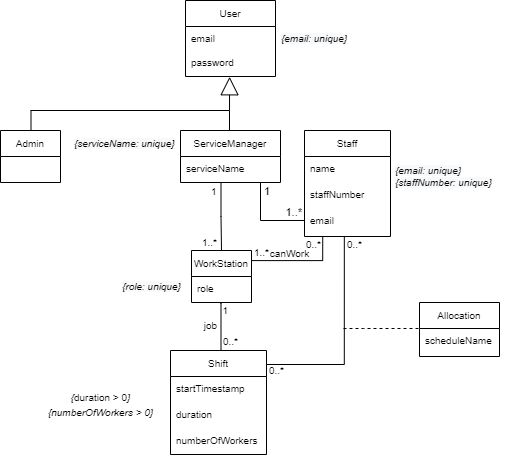
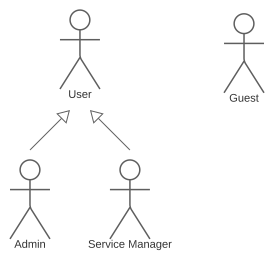

# Product Management

## Product Vision

For those who need to create schedules for their staff, toEaseShifts is the ideal application that will speed up the process with a intuitive and welcoming interface.

This application will allow managers to create multiple departments, staff members, work shifts and specify a set of restrictions that the scheduling algorithm will use to automatically generate the best results, saving the time of doing this by hand.

## Market Research

There are several web applications that are used to manage hospital and medical staff members, work shifts, departments and scheduling, such as [Findmyshift](https://www.findmyshift.com/), [Shiftboard](https://www.shiftboard.com/) and [CliniShift](https://clinishift.com/).

[Findmyshift](https://www.findmyshift.com/) has a lot of features that are analogous to the ones that we want to implement, from which inspiration could be derived. It focus considerably on the data generated from the obtained schedules and in real time information, both to the employee and to the employer. There are some automatic schedule generation features but those are limited to the usage of templates. They do not, however, provide the flexibility necessary to implement arbitrary restrictions and preferences. Only simple shift requests from an employee and weekly schedules are supported. Given that the main objective of the project is to generate a monthly schedule from a set of complex, this application is not a good fit.

[Shiftboard](https://www.shiftboard.com/) is a very through application. From the available information, it supports automated schedule generation. It also supports preferences and matching between employees and their roles within a working environment. There is also no mentions of limitations on the time period for which the generation is done (monthly or weekly). Therefore, it is not unreasonable to infer that a monthly schedule could be generated from the restrictions. The application also includes other useful features like overtime balancing, last minute schedule allocations and shifts trading between employees. Moreover, advertises itself as being indicated for the healthcare industry. At first glance, the application seems to provide most of the functionalities required. Developing the software is therefore a matter of being the proprietor of the software and not having to pay for the service.

[CliniShift](https://clinishift.com/) is also aimed at the medical field. As such, it appears to focus on month-based schedules, which are a requirement for the project. The division between service, station and shift seem to be supported. It allows the employee to input its preferences, to request time off and to switch schedules with one another. However, nowhere does it mention automated schedule generation based on restrictions. It is therefore not a good fit for the project.

[SISQUAL](https://www.sisqualwfm.com/) also provides a similar service and is used by several portuguese hospitals, but is allegedly acclaimed to have a scheduling algorithm that does not satisfy the needed requirements and is very limited in terms of possible restrictions.

## Domain Analysis

-   **User:** Model that represents a user that can authenticate into the system.
-   **Admin:** User that can create new Service Manager accounts.
-   **ServiceManager:** User that can control the schedule generation and manage the staff members, workstations and shifts.
-   **Staff:** For whom the schedule is generated. Can be assigned to shifts in a workstation.
-   **WorkStation:** Represents a job that a Staff member may do. Has shifts that need to be assigned to a Staff upon the schedule generation.
-   **Shift:** Represents an interval of time in which a specific number of workers will be allocated upon the schedule generation.

## Actors

The following diagram shows the actors of the system for the purposes of documenting the meaning of each role in the user stories.

| Actor               | Description                                                                                    |
| ------------------- | ---------------------------------------------------------------------------------------------- |
| **Guest**           | A guest is someone who is not logged in and is only able to log in.                            |
| **User**            | A user is someone who is logged in and is able to log out or change their credentials.         |
| **Admin**           | An admin is a user who is responsible for the creation and administration of services.         |
| **Service Manager** | A service manager is a user who is responsible for the scheduling system of its staff members. |
